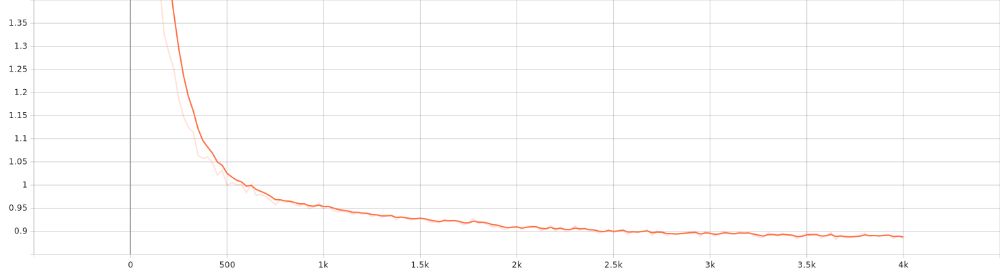

# Emotion-Aware TTS Style Transfer

> End-to-end **emotion-aware text-to-speech (TTS)** with style transfer on top of Microsoft **SpeechT5**, using **WavLM** for prosody/emotion representation and **SpeechBrain ECAPA** for speaker embeddings. Includes a minimal **Gradio** demo, a CLI inference script, training scaffolding, and **AWS SageMaker** utilities.
## 🚀 Model on Hugging Face

[](https://huggingface.co/Amirhossein75/Emotion-Aware-TTS-Style-Transfer)

<p align="center">
  <a href="https://huggingface.co/Amirhossein75/Emotion-Aware-TTS-Style-Transfer">
    
  </a>
</p>

---

## Table of Contents
- [Overview](#overview)
- [Key Features](#key-features)
- [Architecture at a Glance](#architecture-at-a-glance)
- [Repository Structure](#repository-structure)
- [Requirements](#requirements)
- [Quickstart](#quickstart)
- [Data Preparation (RAVDESS)](#data-preparation-ravdess)
- [Training](#training)
- [Inference](#inference)
  - [CLI](#cli)
  - [Gradio app](#gradio-app)
- [AWS SageMaker (optional)](#aws-sagemaker-optional)
- [Notes & Tips](#notes--tips)
- [Ethics & Responsible Use](#ethics--responsible-use)
- [FAQ](#faq)
- [References](#references)
- [License](#license)

---

## Overview

This project demonstrates **emotion-aware style transfer for TTS**. It fine-tunes / adapts a SpeechT5 TTS backbone and **injects emotion and speaker information** at synthesis time:

- **Emotion / prosody**: extracted from a **reference WAV** using **WavLM (base-plus)**, then projected into a compact style vector by a trainable **`StyleAdaptor`**.
- **Speaker identity**: extracted from a reference (or target) WAV using **SpeechBrain ECAPA-TDNN** speaker encoder.
- **Fusion**: a trainable **`StyleSpeakerFusion`** merges both vectors into a 512-D embedding that SpeechT5 expects as `speaker_embeddings` during synthesis.
- **Vocoder**: SpeechT5’s official **HiFi-GAN** vocoder renders the waveform.

A minimal **Gradio** UI and a **CLI** script are provided to run local inference once you have a trained checkpoint directory containing the model and the style modules.

> **Status**: Working demo code & scripts are provided. You will need to train / adapt the model (or use your own finetuned SpeechT5 checkpoint) and provide the two style module weights: `style_adaptor.pt` and `style_fusion.pt` (both expected in the checkpoint dir by default).

---

## Key Features

- 🧠 **SpeechT5** backbone for high-quality TTS, with optional PEFT/LoRA loading if an `adapter_config.json` is found in your checkpoint directory.
- 🎭 **Emotion style transfer** via **WavLM** mean-pooled hidden states → `StyleAdaptor`.
- 🗣️ **Target speaker control** via **SpeechBrain ECAPA** embeddings, optionally separate from the style reference.
- 🔗 **Fusion module** (`StyleSpeakerFusion`) to produce the 512-D `speaker_embeddings` for SpeechT5.
- 🖥️ **Gradio** demo (`src/app.py`) for interactive synthesis.
- 🛠️ **CLI** inference (`src/infer_emotts.py`) for batch or scripted runs.
- ☁️ **AWS SageMaker** utilities for training jobs and real-time/async deployment (`sagemaker/`).

---

## Architecture at a Glance

```
Text ──► SpeechT5 (encoder/decoder) ──► Mel ──►  HiFi-GAN vocoder ──► Waveform
             ▲
             │ 512-D speaker_embeddings (fusion output)
             │
      ┌──────────────┐        ┌──────────────────────┐
      │  ECAPA (spk) │        │  WavLM (style/pros.) │
      └──────┬───────┘        └──────────┬───────────┘
             │                            │
             ▼                            ▼
      speaker vector                style latent (mean-pooled)
             └────► StyleSpeakerFusion ◄────┘
                         ▲
                   StyleAdaptor
```

- **SpeechT5 TTS**: `microsoft/speecht5_tts` (+ `microsoft/speecht5_hifigan` vocoder)
- **Style backbone**: `microsoft/wavlm-base-plus`
- **Speaker backbone**: `speechbrain/spkrec-ecapa-voxceleb`

---

## Repository Structure

```
.
├── data/
│   └── raw.py                 # Build a CSV manifest (RAVDESS) from extracted wavs
├── sagemaker/
│   ├── config.example.yaml    # Region/role/S3 + hyperparameters
│   ├── deploy_asynch.py       # Create async inference endpoint
│   ├── deploy_realtime.py     # Create real-time endpoint (optional data capture)
│   ├── inference.py           # SageMaker handler (JSON in -> WAV out)
│   ├── invoke_realtime.py     # Invoke the real-time endpoint
│   ├── requirements.txt       # Inference-time deps for SageMaker
│   └── train_job.py           # Launch managed training job
├── src/
│   ├── app.py                 # Gradio app (local UI)
│   ├── infer_emotts.py        # CLI inference
│   ├── make_manifest.py       # (helper) manifest tooling
│   ├── style_modules.py       # StyleAdaptor + StyleSpeakerFusion (trainable)
│   ├── train_emotts.py        # Training script
│   └── utils.py               # Helper utilities
├── requirements.txt           # Local dev/inference/training requirements
└── README.md                  # (this file)
```

> Tip: The project uses PyTorch, Hugging Face `transformers`/`datasets`/`accelerate`, SpeechBrain, and Gradio.

---

## Requirements

- Python 3.10+ (SageMaker example uses **py311**)
- NVIDIA GPU + CUDA (recommended; CPU also runs but slower)
- Install deps:

```bash
pip install -r requirements.txt
```

Key libraries (subset): `torch`, `torchaudio`, `transformers`, `datasets`, `accelerate`, `speechbrain`, `soundfile`, `peft`, `gradio`, `huggingface_hub`. Optional: `bitsandbytes` (for 8-bit/QLoRA on supported GPUs).

---

## Quickstart

### 1) Prepare data (RAVDESS)

1. Download and extract **RAVDESS speech** so you have a folder like `Audio_Speech_Actors_01-24/` on disk.
2. Generate a CSV manifest compatible with this repo:
   ```bash
   python data/raw.py
   ```
   It writes `data/ravdess_manifest.csv` with columns: `path, text, emotion, speaker, style_path`.

> The RAVDESS filenames encode **emotion**, **intensity**, **statement** (“Kids are talking by the door” / “Dogs are sitting by the door”), **repetition**, and **actor**. The helper `data/raw.py` decodes those into the manifest.

### 2) Train (see details below)

### 3) Run inference (CLI or Gradio)

---

## Data Preparation (RAVDESS)

- **Input layout**: the script `data/raw.py` expects the extracted directory to be named (or symlinked as) `Audio_Speech_Actors_01-24/` at your working dir. You can edit `ROOT` in the script to point elsewhere.
- **Emotion labels**: mapped from the RAVDESS code numbers to {{neutral, calm, happy, sad, angry, fearful, disgust, surprise}}.
- **Statements**: two fixed prompts in the dataset; the script maps them into `text` for TTS training/eval.
- **Output**: `data/ravdess_manifest.csv` usable by the training script.

If you want to adapt other emotion datasets, mimic this CSV format (`path`, `text`, `emotion`, `speaker`, `style_path`) and adjust the training script’s dataset loader accordingly.

---

## Training

The main training entry point is `src/train_emotts.py`. It fine-tunes a SpeechT5 TTS checkpoint while jointly learning the two **style modules**:

- `StyleAdaptor`: projects mean-pooled **WavLM** features (emotion/prosody) to a compact style latent.
- `StyleSpeakerFusion`: merges **speaker** and **style** latents into a **512-D** vector consumed by SpeechT5 as `speaker_embeddings`.

Typical hyperparameters you’ll tune include **epochs**, **batch size**, **learning rate**, and **sample rate**. A convenient reference is provided in `sagemaker/config.example.yaml`:

```yaml
epochs: 5
batch_size: 8
lr: 3e-4
sample_rate: 22050
```

> **Run locally** (discover flags):
```bash
python -m src.train_emotts --help
```
Look for arguments such as input CSVs (train/val), output directory (e.g., `runs/emotts_esd`), optimizer settings, and whether to enable PEFT/LoRA.

**Download** the finetuned weights and tensorboard logs with bellow hyperparameter from [here](https://drive.google.com/file/d/1F4MzWeWjVvifTCUfAkNcbE8HZ9AshELI/view?usp=sharing)

## 🔧 Core Hyperparameters

| Category | Parameter | Default / Value | Notes |
|---|---|---:|---|
| **Data I/O** | `--csv` | `../data/ravdess_manifest.csv` | Manifest with `path,text,emotion,speaker,style_path` |
|  | `--out_dir` | `runs/emotts_ravdess` | Training outputs, logs, checkpoints |
| **Base Models** | `--base_tts` | `microsoft/speecht5_tts` | Sequence‑to‑sequence TTS backbone |
|  | `--vocoder` | `microsoft/speecht5_hifigan` | Used at inference time for waveform synthesis |
| **Style / SSL** | `--ssl_name` | `microsoft/wavlm-base-plus` | WavLM for style vectors (mean‑pooled hidden states) |
|  | `--spk_embedder` | `speechbrain/spkrec-ecapa-voxceleb` | For x‑vector speaker embeddings |
| **Steps & LR** | `--max_steps` | **4000** | Total training steps |
|  | `--lr` | **1e-5** | Learning rate |
| **Batching** | `--per_device_train_batch_size` | **4** | Per‑GPU train batch size |
|  | `--per_device_eval_batch_size` | **2** | Per‑GPU eval batch size |
|  | `--gradient_accumulation_steps` | **8** | Effective batch = `per_device_bs × grad_accum × #GPUs` |
| **Warmup** | `--warmup_steps` | **500** | Linear warmup steps |
| **Precision** | `--fp16` | *flag* | Mixed precision when passed |
| **Emotion Loss** | `--emo_ce_weight` | **0.2** | Weight for emotion CE term in total loss |
> **Outputs**: after training, save **(1)** the SpeechT5 checkpoint directory (processor + model), and **(2)** the two module weights: `style_adaptor.pt` and `style_fusion.pt` in the same directory (the inference code looks for them there by default).

---

## 🧩 LoRA / PEFT (Optional)

| Parameter | Default | Description |
|---|---:|---|
| `--use_lora` | *flag* | Enable LoRA adapters on target linear layers |
| `--lora_r` | 16 | Rank |
| `--lora_alpha` | 32 | Scaling |
| `--lora_dropout` | 0.05 | Dropout on LoRA paths |
| `--lora_target` | `attn` | One of: `attn`, `mlp`, `all` |
| `--merge_lora_on_save` | **True** | Merge adapters into base weights on save (if supported) |

> Target layer names are inferred from module names (e.g., `q/k/v/o`, `*_proj`, `fc1/fc2`, `wi/wo`). If nothing is found, a safe default set is used.
## 🖥️ Training Hardware & Environment

- **Device:** Laptop (Windows, WDDM driver model)
- **GPU:** NVIDIA GeForce **RTX 3080 Ti Laptop GPU** (16 GB VRAM)
- **Driver:** **576.52**
- **CUDA (driver):** **12.9**
- **PyTorch:** **2.8.0+cu129**
- **CUDA available:** ✅

---

## 📊 Training Logs & Metrics

- **Total FLOPs (training):** `3,285,475,498,393,600`
- **Training runtime:** `2,391.8157` seconds
- **Logging:** TensorBoard-compatible logs 

You can monitor training live with:

```bash
tensorboard --logdir ##yourdir
```

### 📉 Loss Curve

The following plot shows the training loss progression:


## Inference

You can synthesize audio by conditioning on **text** + a **style reference WAV** (emotion/prosody). Optionally, provide a **separate target-speaker WAV** for voice identity (or leave it unset to reuse the style WAV for both).

### CLI

```bash
python -m src.infer_emotts   --ckpt_dir runs/emotts_esd   --text "I can't believe this happened."   --style_wav /path/to/style_reference.wav   --target_spk_wav /optional/path/to/target_voice.wav   --out_wav emotts_out.wav
```

- `--ckpt_dir` points to your fine-tuned SpeechT5 directory. If you trained with PEFT and only saved adapters, keep the adapter files in this dir; the code will wrap a base **microsoft/speecht5_tts** automatically when it detects `adapter_config.json`.
- `--style_wav` is required and provides the **emotion/prosody**.
- `--target_spk_wav` is optional; if missing, the **style** file is reused for speaker identity.
- Output is written to `--out_wav` (default `emotts_out.wav`).

### Gradio app

```bash
python -m src.app
```

The app prompts for:
- **Checkpoint dir** (defaults to `runs/emotts_esd`)
- **Text**
- **Style / reference WAV**
- **Optional target speaker WAV**

The demo writes a `gradio_emotts_out.wav` and also plays audio inline. (By default, the app writes at **16 kHz**; you can adjust this in the code to match your training pipeline.)

---

## AWS SageMaker (optional)

This repository ships a minimal set of SageMaker utilities under `sagemaker/`:

- **Training**: use `train_job.py` with `sagemaker/config.example.yaml` to launch a managed training job (configure region, IAM role, S3 paths, instance type, and hyperparameters).
- **Real-time inference**: `deploy_realtime.py` spins up a real-time endpoint, optionally enabling **Data Capture**. Use `invoke_realtime.py` to send JSON requests.
- **Asynchronous inference**: `deploy_asynch.py` deploys an async endpoint that writes results to S3.
- **Handler**: `inference.py` defines `model_fn`, `input_fn`, and `predict_fn`. It expects JSON containing at least `"text"` (and optionally an `"emotion"` tag). The handler includes a safe **sine-wave fallback** if the project synth method is not wired yet; you can integrate your local `synthesize(...)` there for full fidelity.

> **Heads-up**: Align your **sample rate** across training and inference. The SageMaker example uses **22.05 kHz** in the example config; the local Gradio demo writes **16 kHz** by default.

---

## Notes & Tips

- **PEFT/LoRA**: If your checkpoint directory contains an adapter (`adapter_config.json`), the app will wrap a base `microsoft/speecht5_tts` and load your adapter weights before inference.
- **Caching**: The demo lazily loads models and caches them for speed.
- **GPU vs CPU**: Everything runs on CPU but expect much slower inference/training.
- **Manifests**: You can repurpose `src/make_manifest.py` or author your own scripts to build CSVs for different datasets; keep the same column contract.
- **Reproducibility**: For deterministic results, set seeds and pin package versions.

---

## Ethics & Responsible Use

This repository enables **style / emotion transfer** for speech synthesis. Please **do not misuse** it for impersonation, deception, or any activity that could violate consent, privacy, or the law. Always obtain explicit permission to use someone’s voice or likeness, and label synthetic audio where appropriate.

---

## FAQ

**Q: Do I need both `style_adaptor.pt` and `style_fusion.pt`?**  
Yes. Inference expects both files in the checkpoint directory (or provide their paths explicitly when calling modules from your own code).

**Q: Can I use a separate speaker reference?**  
Yes. Provide `--target_spk_wav` in the CLI (or the second audio field in Gradio).

**Q: Which models are used under the hood?**  
- SpeechT5 TTS (`microsoft/speecht5_tts`) + HiFi-GAN vocoder (`microsoft/speecht5_hifigan`)  
- WavLM Base-Plus (`microsoft/wavlm-base-plus`) for style/prosody  
- SpeechBrain ECAPA (`speechbrain/spkrec-ecapa-voxceleb`) for speaker embedding

**Q: What dataset does `data/raw.py` support out of the box?**  
The **RAVDESS** speech subset. You can extend the same CSV format to other datasets.

---

## References

- **Repo code**: `src/app.py` (Gradio, PEFT adapter loading, fusion to 512-D), `src/infer_emotts.py` (CLI), `data/raw.py` (RAVDESS manifest).  
- **Backbones**:  
  - SpeechT5 TTS: https://huggingface.co/microsoft/speecht5_tts  
  - WavLM (base-plus): https://huggingface.co/microsoft/wavlm-base-plus  
  - SpeechBrain ECAPA: https://huggingface.co/speechbrain/spkrec-ecapa-voxceleb  
- **Dataset**: RAVDESS (Ryerson Audio-Visual Database of Emotional Speech and Song)

---

## License

No explicit OSS license file is provided in this repository as of 2025-08-25. That typically means **all rights reserved** by default. If you intend to use or distribute this work beyond personal experiments, please contact the author(s) or add an explicit license.

---

### Acknowledgements

- Microsoft SpeechT5 team and contributors.
- Hugging Face `transformers` / `datasets` / `accelerate`.
- SpeechBrain team for ECAPA speaker encoders.
- The RAVDESS dataset creators and maintainers.

---

**Changelog**  
- 2025-08-25: First public README authored from repository sources.
